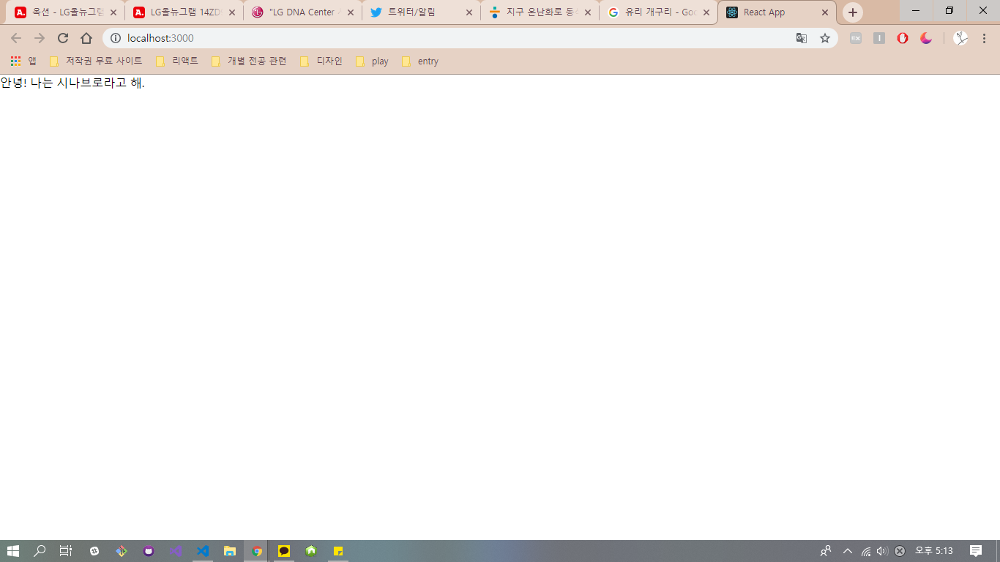

## 리액트의 props와 state
쉽게 설명하자면 props는 부모 컴포넌트에서 자식 컴포넌트로 전해주는 값이고, state는 컴포넌트 내부에서 자체적으로 선언한 값이다. 언뜻 보면 쉬운 개념이지만, props와 state는 리액트에서 가장 중요한 개념 중 하나이다. 이 파일에서는 props와 state에 대해 자세히 알아보도록 하겠다.
 
## props
리액트를 사용하다 보면 **절대로 변해서는 안되는 값**을 사용해야 할 때가 종종 있다. 이럴 때에 props를 사용한다. props는 부모 컴포넌트에서 자식 컴포넌트로 전해주는 값을 말하는데, **props의 값을 변경시킬 수는 없다.** 즉, 다른 말로 사용자가 컴포넌트에 전달되어서 보관하길 원하는 데이터라고 말할 수 있다. 만일 props의 값을 변경하려고 한다면, **자식 컴포넌트가 아닌 부모 컴포넌트에서 값을 변경해야 한다.** props는 개발에서 자주 사용되는 용어인 프로퍼티(properties)의 줄임말이다. 
 
### props 추가하기 
자식 컴포넌트에서 부모 컴포넌트가 전달해 준 props를 조회하고 싶을 땐, `this.`키워드를 사용하면 된다. 만일, 우리가 Props라는 컴포넌트를 만들었고 그 컴포넌트에서 부모 컴포넌트가 전달해 준 props의 값을 조회하고 싶다고 가정하자. 부모 컴포넌트는 당연하게도 `App.js`이다. 이런 경우에는 다음과 같이 코드를 작성한다.    

~~~js
// Props.js
improt React, { Component } from 'react';

class Props extends Component {
    render() {
        return( //부모 컴포넌트에서 name 이라는 props를 받아와 띄움
            

                안녕! 나는 {this.props.name}라고 해.  
            

        );
    }
}

export default Props;

// App.js
import React, { Component } from 'react';
import Props from './Props'; //두 컴포넌트가 같은 경로에 있다고 가정함, 컴포넌트를 상속하는 과정

class App extends Component {
    render() {
        return(
            <Props name="시나브로" /> //자식 컴포넌트에게 전해줄 props의 값을 시나브로라고 지정
        );
    }
}

export default App;
~~~
이렇게 코드를 수정한다면 페이지는 다음과 같은 모습을 띄게 된다.   
  

### defaultProps
defaultProps는 말 그대로 **props의 기본 값**이다. 주로 props를 실수로 빠트려먹는 상황을 대비하거나, 특정 상황에 props를 일부러 비울 때 사용한다.  
defaultProps 값의 선언은 다음과 같다.  

~~~js
import React, { Component } from 'react';

class Props extends Component {
    render() {
        static defaultProps = {
            name: '기본 이름'
        } 
        return (
            

            안녕! 나는 {this.props.name}라고 해.
            

        );
    }
}
//혹은
Props.defaultProps = {
    name: '기본 이름'
};

export default Props;
~~~ 
 

함수형 컴포넌트에서 defaultProps를 설정할 땐, 전자말고 후자의 방법을 사용하면 된다.
 
### 함수형 컴포넌트
한 컴포넌트를 사용할 때, 단순히 props만 받아와서 사용하는 컴포넌트의 경우는 굳이 `class`로 선언하지 않고 더욱 편한 방법으로 사용할 수 있다. 바로 **함수 형식으로 작성**하는 것이다. 위의 코드를 함수형 컴포넌트로 작성하면 아래와 같은 형태가 만들어진다.  

~~~js
import React, { Component } from 'react';

const Props = ({name}) => {
    return (
        

            안녕! 나는 {name}라고 해.
        

    );
};

export default Props;
~~~

  단, 함수형 컴포넌트는 **state와 LifeCycle이 빠져있다.** 그렇기 대문에 컴포넌트의 초기 마운트가 조금 더 빠르고 메모리 자원을 덜 사용한다. 하지만 아주 미세한 차이이므로 크게 신경 쓸 필요가 없다. 즉, **성능적으로는 큰 차이가 없다.**  

## state
지금까지 **정적인 데이터, props**에 대해 알아보았다. 이제는 **동적인 데이터 state**를 알아볼 차례이다. 앞서 설명했듯, props는 데이터를 변경할 수 없지만 state는 변경할 수 있다. 그렇기 때문에 state를 동적인 데이터라고 한다. 하지만 state를 최대한 줄이는 것이 **리액트에서 효율적**이다. 기본적으로 컴포넌트에는 state가 없다.  

### state 정의 
컴포넌트의 state를 정의할 땐 `class field`문법을 사용한다. 만일 `class field`문법을 사용하지 않는다면, 아래와 같은 코드로 작성해야 한다. 

~~~js
import React, { Component } from 'react';

class App extends Componet(
    constructor(props) {
        super(props);
        let state = {
            number: 0;
        }
    }
)
~~~

### 메소드 작성

### setState

### 이벤트 설정

## props와 state의 비교